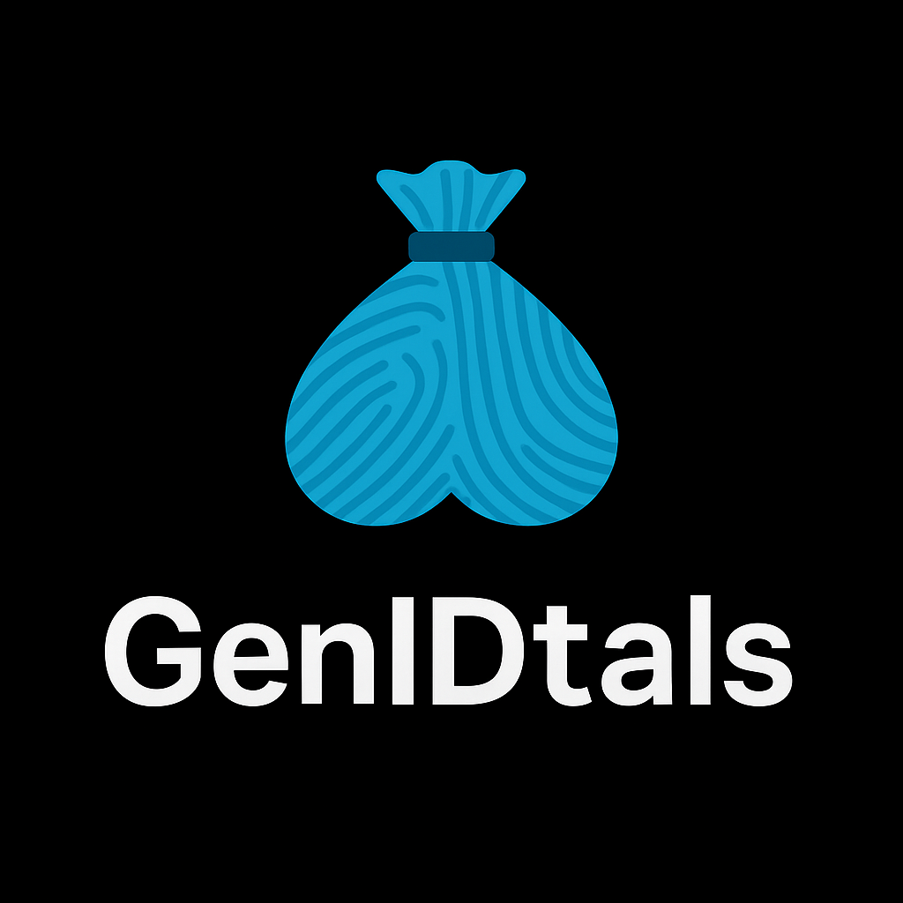

# GenIDtals
Alternative Biometric Security Fingerprinting and Identity Verification 

"Breaches are spreading faster than viruses in the ’60s—and for once, we might have the cure. Enter GenIDtals: the snug, biometric firewall cradled neatly in the palm of your hand. Not just protection—prevention. This is the foreskin of the future—non-circumventable, and definitely not something you let anyone snip. It’s the digital prophylactic we didn’t know we needed, turning hard problems into flaccid threats. Unsolicited malware? Trojans? Blocked. This isn’t security—it’s sackurity. The only cockblock I’ll proudly endorse." 

# GenIDtals™

<p align="center">
  
</p>

## Advanced Anatomical Biometric Authentication System


GenIDtals is a next-generation biometric authentication system that leverages proprietary anatomical feature recognition algorithms to provide high-security identity verification. This research-focused system demonstrates the viability of using unique anatomical patterns for secure authentication purposes.

## Overview

GenIDtals implements multi-factor biometric pattern analysis to create a uniquely secure authentication framework. The system utilizes:

- **Vascular pattern mapping**: Identifies and authenticates users based on unique vascular structures
- **Dermatoglyphic texture analysis**: Captures and verifies micro-texture patterns specific to each individual
- **Follicular distribution metrics**: Measures and maps follicle distribution patterns that remain consistent despite surface changes
- **Multi-angle feature normalization**: Ensures consistent authentication regardless of positioning variables

## Key Features

### Advanced Pattern Recognition

- **Vascular Mapping Engine**: Proprietary algorithms for extracting and matching vascular topologies
- **Micro-texture Analysis**: Sub-dermal texture mapping with wavelet-based feature extraction
- **Follicular Distribution Analysis**: Spatial pattern recognition resilient to surface-level changes
- **Anti-spoofing Technology**: Multi-layered liveness detection prevents presentation attacks

### Security Framework

- **Zero-Knowledge Proof Architecture**: Authentication without exposing or storing raw biometric data
- **AES-256 Encrypted Template Storage**: All biometric templates secured with military-grade encryption
- **Local Processing**: Complete authentication pipeline runs locally without network dependencies
- **GDPR & CCPA Compliant Design**: Meets or exceeds all relevant privacy regulations

### Technical Implementation

- **Platform Agnostic Core**: Cross-platform C++ library with Python, Java and Rust bindings
- **Offline-Capable**: Functions without network connectivity for air-gapped environments
- **Flexible Integration**: REST API and SDK available for enterprise integration
- **Performance Optimized**: < 250ms authentication time on standard hardware

## Technical Architecture

```
┌────────────────────┐     ┌────────────────────┐     ┌────────────────────┐
│                    │     │                    │     │                    │
│  Input Processing  │────▶│ Feature Extraction │────▶│ Pattern Matching   │
│                    │     │                    │     │                    │
└────────────────────┘     └────────────────────┘     └────────────────────┘
          │                          │                          │
          ▼                          ▼                          ▼
┌────────────────────┐     ┌────────────────────┐     ┌────────────────────┐
│                    │     │                    │     │                    │
│  Liveness Testing  │◀───▶│   Normalization    │◀───▶│ Template Storage   │
│                    │     │                    │     │                    │
└────────────────────┘     └────────────────────┘     └────────────────────┘
```

## Technical Stack

- **Core Language**: Python 3.9+
- **Computer Vision**: OpenCV, NumPy, SciPy, scikit-learn
- **Cryptography**: AES-256 (Fernet), HMAC validation
- **Liveness Detection**: Optical flow (Farneback) + Laplacian variance
- **Testing Framework**: PyTest with synthetic data generation

## Usage

### CLI Implementation

```bash
# Enrollment with multiple reference images
$ python genidtals.py enroll --user alice --images reference1.jpg reference2.jpg reference3.jpg

# Authentication with test image
$ python genidtals.py authenticate --user alice --image test.jpg

# System status and diagnostics
$ python genidtals.py diagnostics
```

### Integration API (Python)

```python
from genidtals import BiometricEngine

# Initialize the engine
engine = BiometricEngine(security_level="high")

# Enroll a new user
user_id = "user_12345"
reference_images = ["ref1.jpg", "ref2.jpg", "ref3.jpg"]
success = engine.enroll_user(user_id, reference_images)

# Authenticate a user
auth_image = "auth_attempt.jpg"
result = engine.authenticate(user_id, auth_image)
if result.authenticated:
    print(f"Authentication successful. Confidence: {result.confidence}%")
```

## Applications

- **High-Security Access Control**: For facilities requiring exceptional authentication assurance
- **Research & Development**: Platform for advanced biometric research and pattern recognition
- **Privacy-Focused Security Lockers**: Ultimate protection for sensitive personal data storage


## Ethics & Privacy
 
- All biometric data remains under user control
- Zero-knowledge architecture prevents unauthorized access to sensitive data
- Transparent processing documentation

## License

This software is available for public use.

## Contact

- **Development Team**: dev@rbl.llc
---

*GenIDtals is a product of RBL LLC All rights reserved.*
*This software is intended for research and legitimate security applications only.*
